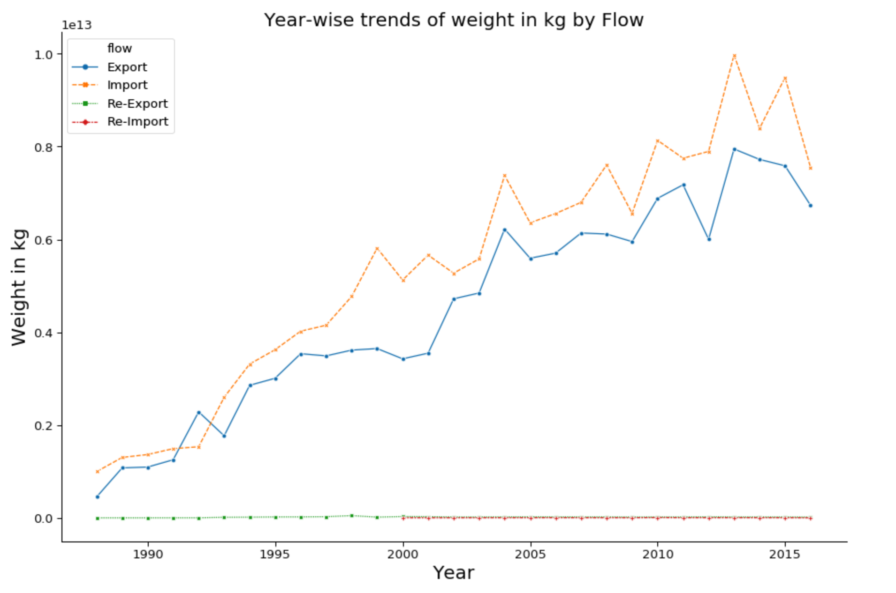

# Visualizing Global Commodity Statistics using Azure, PySpark and Python :smiley: fa18-523-79, fa18-523-81, fa18-523-82

| Abhishek Rapelli, Harika Putti, Pavan Kumar Madineni
| arapelli@iu.edu, haputti@iu.edu, pmadinen@iu.edu
| Indiana University, Indiana University
| hid: ffa18-523-79, fa18-523-81, fa18-523-82
| github: [:cloud:](https://github.com/cloudmesh-community/fa18-523-81/blob/master/project-report/report.md)
| code: [:cloud:](https://github.com/cloudmesh-community/fa18-523-81/tree/master/project-code)

## Abstract

Economists, governments, trading organizations and even general public may be curious to know about the international trading patterns between different nations across the globe on various commodities. For example, one may be curious to get answers to some interesting questions like which is the largest importer of steel in the world? Which country has the highest growth in sheep production? What is America’s chocolate consumption this year? These kinds of questions can be answered by analyzing the huge volume of data that is collected from the trading transactions that happens globally among various countries. The idea is to do exploratory data analysis to find patterns and insights that may be helpful in answering such questions or raise more such new questions from observations.

## Keywords

fa18-523-81, fa18-523-79, fa18-523-82, Exploratory Data Analysis, Python, PySpark, HDFS, HBase, Watson Analytics

## Introduction

This dataset contains import and export volumes for 5,000 commodities across most of the countries on the globe over the past 30 years. Trade across the globe plays a prominent role in the economy of a nation. We are looking ahead to check for any peculiar patterns in the commodities traded by different countries in accordance with time in the past 30 years. We have imported the dataset from the UNDate site published by the United Nations Statistics Division. The dataset is a 1.2 GB sized dataset and we aim to illustrate meaningful correlations among different volumes of commodities traded by different countries in different years. 

## Implementation
### Data 

The dataset was provided by United Nations Statistics division on the UNData website. It consists of data for over 30 years until 2016 covering all nations in the world and around 5000 plus commodities. It has over 8.5 million transactions/records with 10 columns. The total size of the dataset was 1.2 Giga bytes. The 10 variables names are: country, year, commodity code, commodity name/type, flow (import or export), trade in USD, weight in kg, quantity name, quantity and category. There are some missing values as well as outliers in the data. Hence, the data is not ready to be used directly and needs good amount of cleaning and preprocessing.

### Related work 

We have found an earlier work on this dataset, that focused on specific goals about finding the trading patterns for a nation. It has taken only a sample of this dataset than whole data and was more focused on specific countries[@fa18-523-81-kagglekernel].

## Technologies used

*  We have coded entirely in python 3.0 which is a high-level object-oriented programming language used for general programming [@fa18-523-81-python].
* Seaborn is one of the most widely used data visualization packages available in python that is built on top of matplotlib. It provides an interface to draw appealing graphs and draw enlightening factual illustrations. We are primarily using seaborn to draw valuable insights about the trade statistics of different countries out of this huge 1.2 GB data [@fa18-523-81-seaborn].
* Altair is a statistical visualization library available in python based on Vega and Vega-lite. It provides different visualization features that enable to create a wide variety of statistical visualizations very rapidly. In addition to seaborn we are also using Altair to create interactive visualizations to dive deep into the correlations between the trade among different countries [@fa18-523-81-altair].
* Folium is one of the famous visualization libraries available in python used predominantly to visualize geospatial data. Folium enables one to create the map of any location given its latitude and longitude values [@fa18-523-81-folium].
* Matplotlib is one of the most widely used visualization libraries in python that enables producing quality figures in interactive environments across diverse platforms. The major benefit of this library is it can be used to generate visualizations in python scripts, ipython shells, jupyter notebook and also on many other development environments [@fa18-523-81-matplotlib].

The entire data is stored in Azure cloud and is accessed directly from cloud rather than from the local machine. All the interactive visualizations are created using data from cloud in jupyter notebook.

## Visualizations 

We will look at different kinds of visualizations like boxplots, frequency distributions, histograms, bar plots, density plots, etc. of each variable/feature depending on if it is categorical or numerical variable. We will also look at heat maps on correlation matrix between the variables. We may also use geographical plots to visualize the trade volume of each country on map. We shall be using python packages for visualization like Matplotlib, Seaborn, Plotly, Geographical plots majorly.

![Top Importers and Exporters by Country](images/Top-importers-and-exporters-by-country.png {#fig:Topimportersandexportersbycountry}

+@fig:Topimportersandexportersbycountry shows the line graph of top importers and exporters based on Trade in USD.
European Union leads the list of both top 10 importers and exporters, but it has to be noted that EU-28 is a region comprising 28 countries. Most of the countries are heavy import based countries with China being an exception. Countries like USA in particular have a huge trade deficit i.e. the exports are much smaller when compared to imports. Only a few countries like China and Germany have decent trade surplus i.e. these countries import less than their exports which acts like a tremendous boost to their economy.

{#fig:Yearwisetrendsintrade}

+@fig:Yearwisetrendsintrade shows the line graph of Year-wise trends in trade in USD.
It can be clearly seen from the graph that there is a huge dip in the trade in US dollars in the year 2009 which is otherwise very consistently progressive. The trade has recovered immediately by the next year undeterred by this dip in 2009.

{#fig:Yearwisetrendsinweight}

+@fig:Yearwise trends in weight shows the line graph of Year-wise trends in weight in kg.

## Summary

There are a lot of valuable insights that could be discerned from this data. This is a very large dataset that has scope for varying analyses to be done. A few important details learnt out of these visualizations are; China is way ahead of all the other countries as well as other regions in terms of cumulative trade imports and exports. Most traded items among all the countries in general are sheep, goats, bovine animals, poultry and swine which clearly show that these animals are traded for human consumption. China is clearly the leader in terms of both volume as well as consistency in world trade over the years. An astonishing 40 percent of Chinese commodity exports is constituted by woven fabric. To sum up, similar analyses can be performed to extract similar trade statistics for each country or a group of countries as a region, but we have selected only a few aspects of trade to perform analysis for this project.

## Future Work

Though in this project we will be focusing more on big data storage and retrieval, data preprocessing and exploratory data analysis, there is scope to do more work on this by building predictive models using various machine learning, deep learning or forecasting models, depending on the problem statement or goal we set.

## Acknowledgement

We would like to thank the United Nations Statistics Division for kindly publishing this dataset on UNData site. We would also like to thank the professor Dr. Gregor von Laszewski for his valuable inputs in helping us to choose this dataset and also for all the guidance he has provided. We would like to appreciate the effort of the associate instructors for their timely help on Piazza.

## Work breakdown

The authors Abhishek Rapelli, Harika Putti and Pavan Kumar Madineni have worked together and contributed nearly equally in preparing this report. All three of us have organized multiple collaborative sessions to extensively search for a large dataset that would meet the course requirements as well as which would also facilitate in doing quality visualizations. The visualizations are also created with all three of us contributing equally in terms of ideas as well as visualization package selection.
